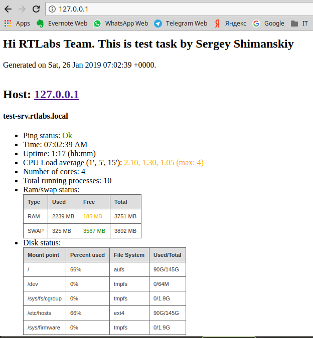

The deployment was performed on Linux Mint 18.1 (Ubuntu 16.04) with Ansible v. 2.7.6; Docker v. 17.09.0-ce installed.

Also Docker SDK for Python must be installed. https://pypi.org/project/docker/
```
pip install docker
```

For deploying service on localhost you should execute following commands:
```
git clone https://github.com/flyer8/rtlabs-task.git /opt/rtlabs-task
ansible-playbook -i /opt/rtlabs-task/inventory /opt/rtlabs-task/playbook.yml
```

